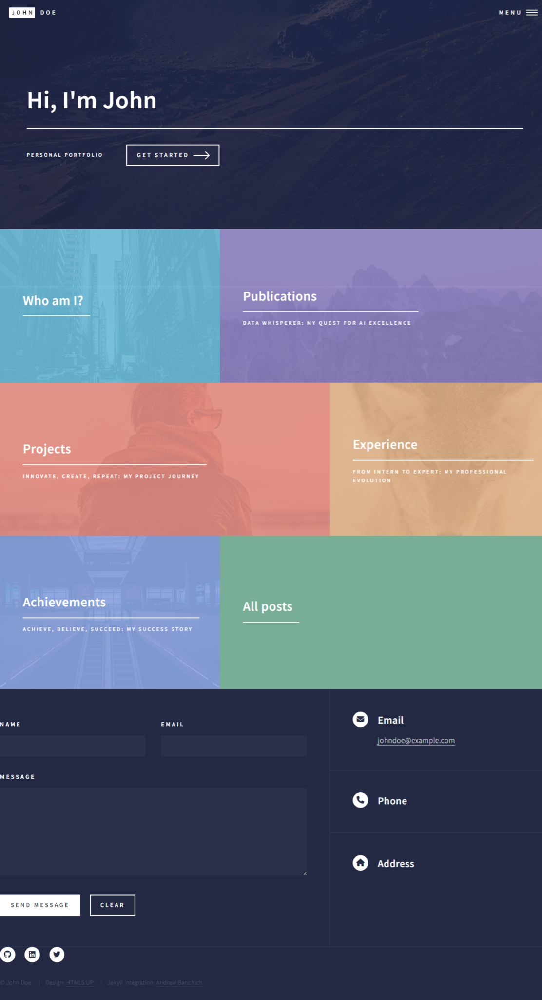
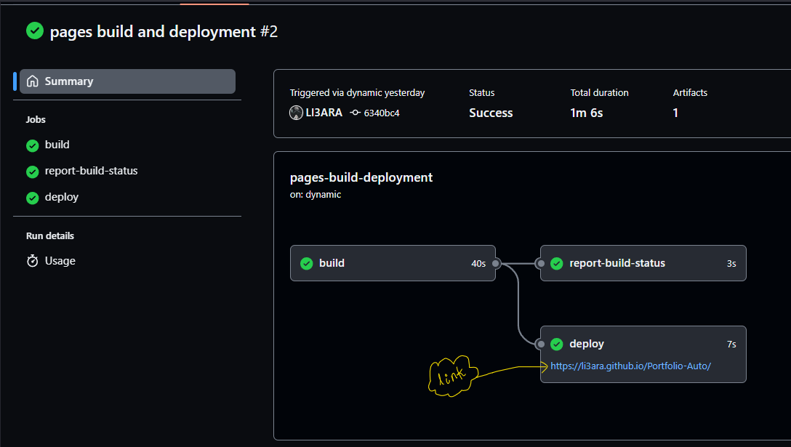

Here you are looking for a easier way to build your portfolio...
Sweat no more!
This project has made it much easier to do it than you think.
Follow along with me.

So.. First starts with 
## Why Portfolio-Auto ?
even created & you should use in first place. 

> Simply, any web-site creation is a time and money spending process, and when is comes to deploy that site you build, it gets even harder and non-trivial. All is all web site development is no easy task in contrast to is seems and your portfolio build is not far different from it. However, when it comes to personal or organizational portfolio website the essential information to need to display stay the same irrespective of industry or personal preferences. So, here __Portfolio-Auto__ take care of all the redundant processes from website styling to deploying, and make you only to concentrate on adding you details to portfolio theme at preference. Although, this doesn't mean you can customize have you own unique theme.

So.. shall we
## Build your portfolio

So.. First, 
### The general process 
of selection to deploying the portfolio

1. fork this github repo into your personal github account
2. go to github action and check you new [but sample] portfolio
3. select the theme at your preference 
4. add your details
5. commit back

Voilà, now your brand new portfolio it up on to the world 

So.. are we finish?
### the step by step guide
if you needed, and of course you need.

#### [step-1] get the code
> Unlike, usual `github` base development, here you don't even need to clone the repo. But, that may I said, you can do the same thing with good old github clone and push process, and this shall be the only way when you customize the themes.

> anyway, let's stop the high horse and go with the simplest path shall we
1. go the [portfolio-auto](https://github.com/nipdep/Portfolio-Auto) original repo, hope you are already there 😉
2. then `fork` the repo onto you personal github user account
   >> here `fork` process guarantee timely updates when the original __portfolio-auto__ repo get new features or themes
3. and, you are good to go to the next step

> BTW, if you are `pro` or one looking to customize themes
1. you can follow above `fork` based step as it said
2. plus, clone the __portfolio-auto__ repo in your personal github account, start work on local.

3. for the advance operation and local testing follow _github_ `Wiki` on [portfolio-auto](https://github.com/nipdep/Portfolio-Auto/wiki)

#### [step-2] Checkout your newly deployed portfolio
__What ??__
> Oh, yes. you have already deployed you portfolio. But, the little problem is there name is 'John Deo' and that guy is a figment of imagination.
<!-- SS- settings url of the page you -->

>> but, Why?
<!-- SS - yaml of workflow/SS of action -->

glad, you asked. __notice__ following section contains some serious CI/CD concepts. so let's get to it
the website deployment happens as a `github-page` and that process is automated by `github-action` more specifically, that repo `.github/workflows` directory contained `jekyll.yml` file see every action happens to the repo (__CI__)  and run jekyll site building and deployment (__CD__) on  `git push to main`, `git pull-request main`
So.. that what it take to deploy at a your commit, and now magic is gone.
<!--  -->

#### [step-3] select your portfolio theme
> here theme are defined by branches of the github repo, specifically branches with name starting from `theme/<theme-name>`

__Preview__ 
> can be simply done just by looking at screen-shots in theme `readme` page 
> when you select the theme, then you open and _pull request_ from you selected theme branch to `dev` branch.

> or, you can deploy theme portfolio test it out. Go to settings> github pages> select the theme branch, hit save and go to actions tab.

<!--  -->

#### [step-4] add your details
First, important file & folders to learn
1. `_config.yml` 

  > define your website configuration
  * website title
  * portfolio description
  * base-url, `"/Portfolio-Auto"` should be same as the your github repo name
  * contact information; phone, address
  * social media information; github, LinkedIn, Facebook, Slack, Instagram
  
2. `index.md`

   > root or the home page of your portfolio
   * nothing important from _content_ aspect
   * but the page layout should be in `home` 
3. `Gemfile` 

   > jekyll website build file
   * again nothing much to change
4. `personal.md`

   > your personal information summary 
   * all the information defined in the `_data/personal.yaml`
   * where you can add __description__, __fields_of_interest__, __soft_skills__, __certificates__
   * also, you can add key-value paired information in __details__

5. routing pages, `projects.md`, `publications.md`, `experience.md`, `achievements.md`
   > these pages contains tag information, routings to all details posts
   * nothing to change
   

6. post pages, `_posts/*` all the `.md` files

   > detail of the post
   * all the posts should be in particular directory in `_posts` as  `post.type`
   * you just have only have to duplicate existing `.md` file under the same directory and change the _front-matter_ accordingly. i.e. except `layout`, `categories`, `type` and `permalink`
   * and `` 
   <!-- SS<- as this is shown -->
   * all the post name should be in `data-nametag.md`, example: `2023-10-23-project_1.md`
   

7. post data pages, `_data/*` all the `.yml` files
   
   > files that contains all the details about you endeavors and only place you truly have to put effort into
   * all the posts should be in particular directory in `_data` as  `post.type`
   * if you are going with current information point in `.yml` files, just duplicate and set file name in `<project-name>.yml`, assuming there will be not duplicate project names found
   * then you just change the actual information under each key.
   * __we strongly recommend you not to add or change keys in those `.yml` files__
   * _for any conciliation you need to add information under new tag, you can do it but it has to taken care in related and all the other post files in `_posts` directory.
   * checkout _github_ `Wiki` on [portfolio-auto](https://github.com/nipdep/Portfolio-Auto/wiki) example of advance operations
   * __all the value names under `technologies` key in any `.yml` file should be in `assets/images/logos` in same name formatting

### [step-5] commit and deploy you portfolio site 
> if you following fully online way, you just have to push commit and check to deployment. 
<!-- SS to show commit in the github -->
> as a next step you could create a _pull request_ from `dev` to `main` branch.
> when you working on local and then follow [the wiki](https://github.com/nipdep/Portfolio-Auto/wiki)
<!--  -->
