Are you searching for an easier way to create your portfolio? Look no further! This project simplifies the process more than you'd imagine. Join me as I guide you through it.

## Why Portfolio-Auto?

Building a website is typically a time-consuming and costly endeavor. When it comes to deploying the site you've built, it becomes even more challenging. Web development isn't as straightforward as it may seem, and creating your portfolio isn't much different. However, the key information to showcase remains consistent, regardless of your industry or personal preferences.

That's where Portfolio-Auto comes in. It streamlines everything, from website styling to deployment, allowing you to focus solely on adding your personal details to your preferred portfolio theme. Don't worry; you can still customize it to create your unique theme.

So, are you ready to start building your portfolio?

### Building Your Portfolio: The General Process

Let's go through the general steps, from selection to deployment.

1. __Fork this GitHub Repository:__ Start by forking this repository to your personal GitHub account.
2. __Select Your Preferred Theme:__ Choose the theme that suits your style.
3. __Add Your Details:__ Fill in your information.
4. __Commit Back:__ Commit the changes.
5. __Check Your New (but Sample) Portfolio:__ Head to GitHub Actions and check out your new portfolio.
Voilà! Your brand-new portfolio is now live and ready to be seen by the world.

But wait, if you need a step-by-step guide, we've got you covered.

## Step-by-Step Guide:

### Step 1: Get the Code

Unlike traditional GitHub-based development, you don't need to clone the repository here. However, if you plan to customize themes, you can still follow the traditional clone and push process. This is the only way to customize themes.

Let's take the simpler path:

1. Go to the [Portfolio-Auto](https://github.com/nipdep/Portfolio-Auto) original repository (hopefully, you're already there!).
2. Fork the repository to your personal GitHub user account. This ensures you receive timely updates when the original Portfolio-Auto repository adds new features or themes.
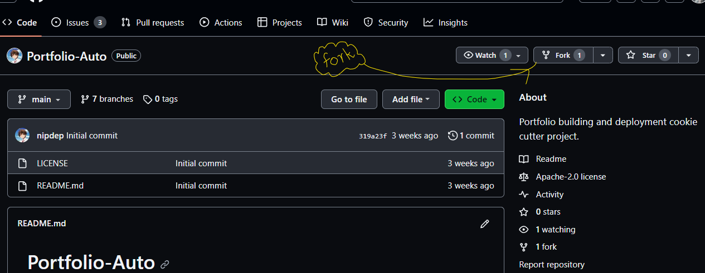

3. You're good to proceed to the next step.
By the way, if you're a pro or someone looking to customize themes:

1. Follow the fork process as mentioned.
2. Additionally, clone the Portfolio-Auto repository to your personal GitHub account and start working locally.
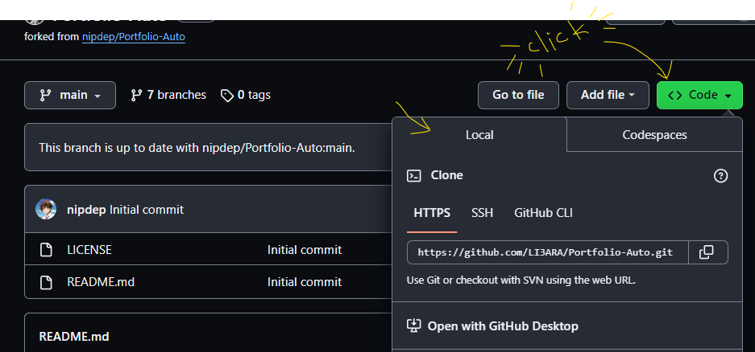

For advanced operations and local testing, consult the GitHub Wiki on [Portfolio-Auto](https://github.com/nipdep/Portfolio-Auto/wiki).

### Step 2: Select Your Portfolio Theme
When setting up your portfolio, the first step is to choose a theme. Themes are defined by branches in the GitHub repository, specifically branches with names starting with `theme/<theme-name>`.
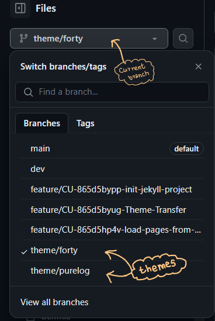

#### Preview:
You can get a preview of a theme in a couple of ways:

1. __GitHub Repository:__ Look at the theme's README page and check for screenshots to get an idea of how your portfolio will look.
2. __Deploy the Theme:__ Alternatively, you can deploy the theme to your GitHub Pages. To do this, follow these steps:
   * Go to the repository's "Settings" tab.
   * In the "GitHub Pages" section, select the theme branch you want to use.
   * Save your changes and then go to the "Actions" tab to monitor the deployment process.
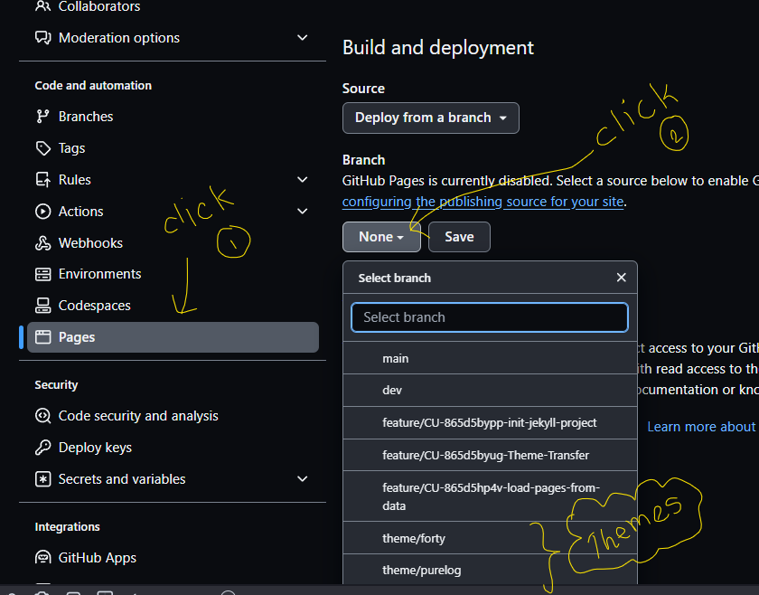
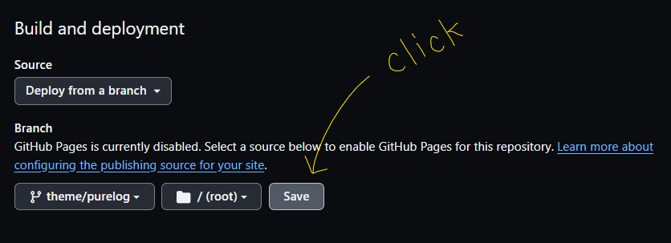
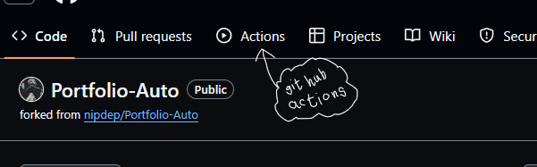
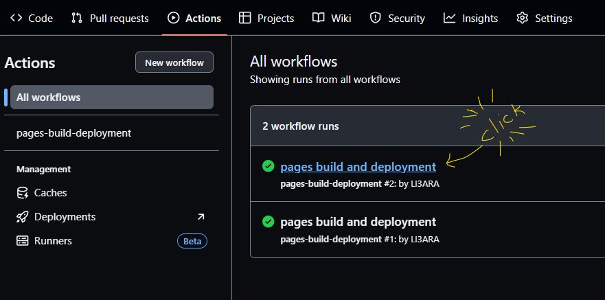

#### Selection:
When you pick a theme, then you open and _pull request_ from you selected theme branch to `dev` branch.
<ss> #PR making
# pr - how the puhttps
> Why? @nipdep

### Step 3: Add Your Details
In this step, you'll customize your portfolio to make it uniquely yours. Here are some important files and folders to be aware of:
#### Options to add your data
1. _VsCode or any other local code editor_:
   * _clone_ you newly forked repo to local using _git_ or _github desktop_
   * you are ready to add your data

2. _GitHub Dev, cloud editor_:
   * press "." (fullstops button) got got to `https://github.dev/<user-name>/Portfolio-Auto`
   * where you can edit/add file online

3. _Github_:
   * preferred when you have a quick single file update, specially in deployed `main` branch
   * not recommended to add/edit multiple file in this way, because here you have to commit at each file

#### Important files and directories to notice
1. `_config.yml`:
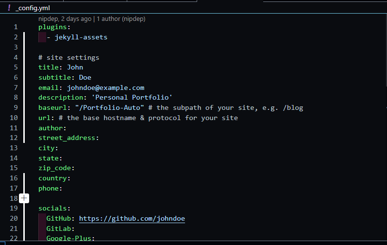

This file defines your website's configuration. You can customize several aspects, including:
* Website title
* Portfolio description
* Base URL (should match your GitHub repo name)
* Contact information (phone, address)
* Social media information (GitHub, LinkedIn, Facebook, Slack, Instagram)

2. `index.md`:
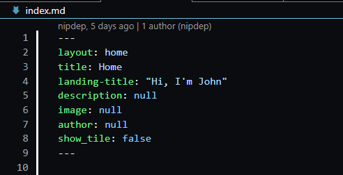

This is the root or home page of your portfolio. You don't need to change the content, but ensure that the page layout is set to "home."

3. `Gemfile`:
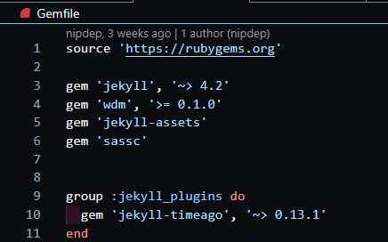

The Gemfile is used for building your Jekyll website. There's typically no need to make significant changes here.

4. `personal.md` & `personal.yaml`:
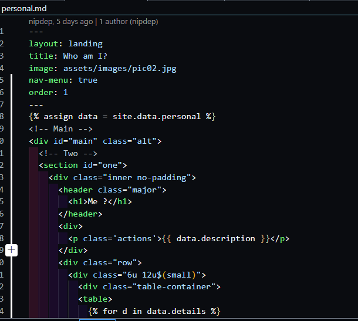

This page contains a summary of your personal information. Information from this file is pulled from _data/personal.yaml, where you can add details like:
* Description
* Fields of Interest
* Soft Skills
* Certificates
* Key-value paired information under "details"
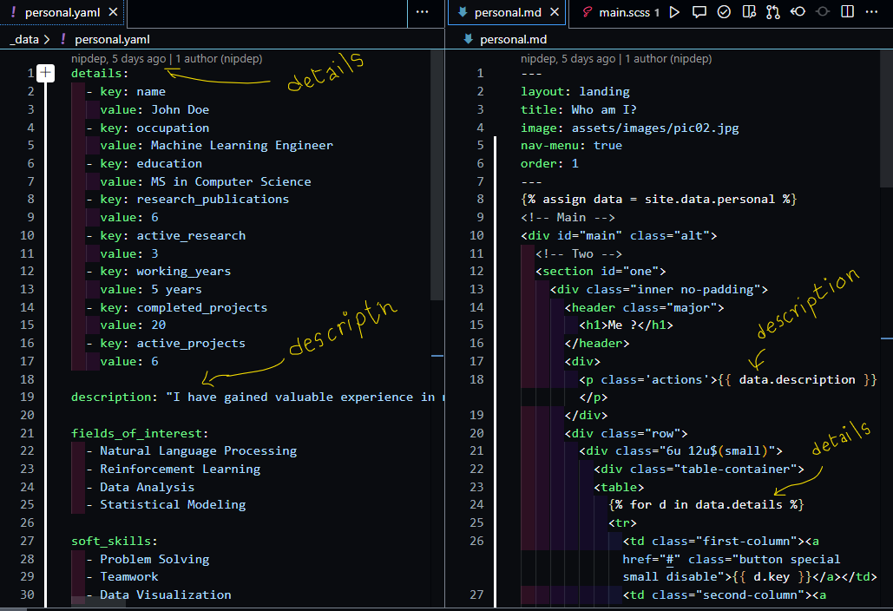

5. _Routing Pages_ (`projects.md`, `publications.md`, `experience.md`, `achievements.md`):
These pages provide routes to all the details posts and generally don't require alterations.
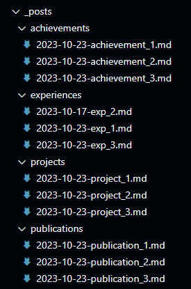

6. _Post Pages_ (`_posts/*`):
These are detailed posts about your projects and achievements. To create new posts, you can:
* Duplicate an existing `.md` file in the relevant directory.
* Change the front-matter settings, except for `layout`, `categories`, `type`, and `permalink`.
* Use `assign pub = site.data.publications.<project-name>` to link your post to a publication.
* Ensure your post file is named in the `data-nametag.md` format (e.g., `2023-10-23-project_1.md`).
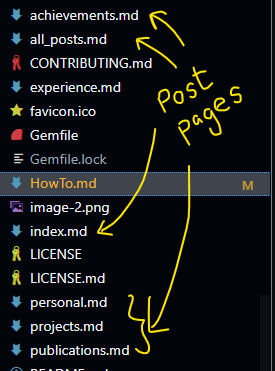
  
7. _Post Data Pages_ (`_data/*`):
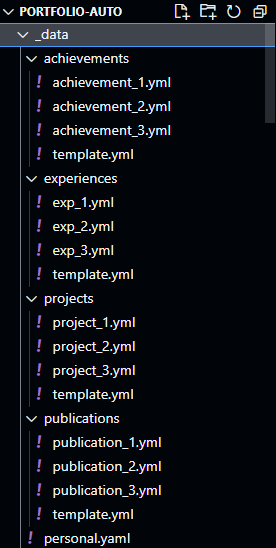

These `.yml` files contain details about your endeavors. To add or modify information:
* Duplicate an existing `.yml` file with a unique name.
* Update the content under each key as needed.
* We recommend not adding or changing keys in these files, except for specific needs, which should be addressed in related post files in the `_posts` directory.
For advanced operations, you can refer to the GitHub Wiki on portfolio-auto for examples.

__Note:__ All the values under the technologies key in any `.yml` file should correspond to files located in `assets/images/logos` with matching file names.
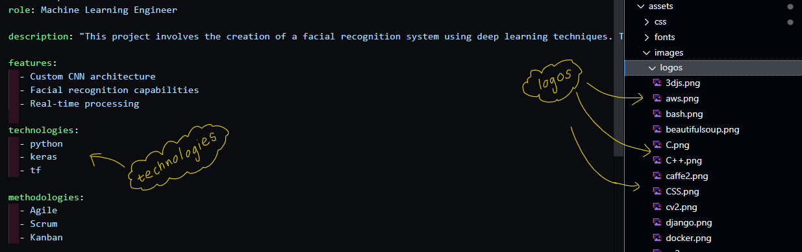

### Step 4: Commit and Deploy Your Portfolio Site
If you're following the online approach, deploying your portfolio site is straightforward. Simply commit your changes and check the deployment. Here are the steps:
1. Commit your changes to your repository.

_If you were editing in GitHub_:

2. Transfer the updates from 'dev' to the deployment `main` branch

> Why? @nipdep
3. Initiate the deployment

4. Verify the deployment process.

### Step 5: Check Your Newly Deployed Portfolio
Congratulations, your portfolio is now live and accessible. But how did it happen? Let's dive into some essential CI/CD concepts:

>The website deployment is powered by GitHub Pages, and this process is automated using GitHub Actions. Specifically, there is a jekyll.yml file in the .github/workflows directory of your repository. This workflow handles both Continuous Integration (CI) and Continuous Deployment (CD).
> * __CI:__ It manages various actions that take place within your repository.
> * __CD:__ It builds and deploys your Jekyll site whenever you push changes to the main branch or create a pull request to main.

So, that's the magic behind deploying your portfolio site. It all starts with a commit, and the rest is taken care of by the automated CI/CD pipeline.
