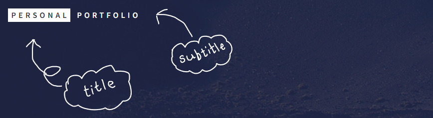
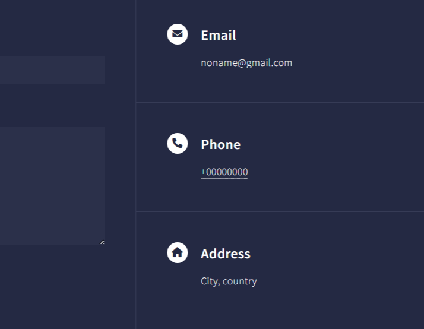

Here you are looking for a easier way to build your portfolio...
Sweat no more!
This project has made it much easier to do it than you think.
Follow along with me.

So.. First starts with 
## Why Portfolio-Auto ?
even created & you should use in first place. 

> Simply, any web-site creation is a time and money spending process, and when is comes to deploy that site you build, it gets even harder and non-trivial. All is all web site development is no easy task in contrast to is seems and your portfolio build is not far different from it. However, when it comes to personal or organizational portfolio website the essential information to need to display stay the same irrespective of industry or personal preferences. So, here __Portfolio-Auto__ take care of all the redundant processes from website styling to deploying, and make you only to concentrate on adding you details to portfolio theme at preference. Although, this doesn't mean you can customize have you own unique theme.

So.. shall we
## Build you portfolio

So.. First, 
### the general process 
of selection to deploying the portfolio

1. fork this github repo into your personal github account
2. go to github action and check you new [but sample] portfolio
3. select the theme at your preference 
4. add your details
5. commit back

Voilà, now your brand new portfolio it up on to the world 

So.. are we finish?
### the step by step guide
if you needed, and of course you need.

#### [step-1] get the code
> Unlike, usual `github` base development, here you don't even need to clone the repo. But, that may I said, you can do the same thing with good old github clone and push process, and this shall be the only way when you customize the themes.

> anyway, let's stop the high house and go with the simplest path shall we
1. go the [portfolio-auto](https://github.com/nipdep/Portfolio-Auto) original repo, hope you are already there 😉
2. then `fork` the repo onto you personal github user account
   >> here `fork` process guarantee timely updates when the original __portfolio-auto__ repo get new features or themes
3. and, you are good to go to the next step

> BTW, if you are `pro` or one looking to customize themes
1. you can follow above `fork` based step as it said
2. plus, clone the __portfolio-auto__ repo in your personal github account, start work on local.
3. for the advance operation and local testing follow _github_ `Wiki` on [portfolio-auto](https://github.com/nipdep/Portfolio-Auto/wiki)

#### [step-2] Checkout your newly deployed portfolio
__What ??__
> Oh, yes. you have already deployed you portfolio. But, the little problem is there name is 'John Deo' and that guy is a figment of imagination.
>> but, Why?
glad, you asked. __notice__ following section contains some serious CI/CD concepts. so let's get to it
the website deployment happens as a `github-page` and that process is automated by `github-action` more specifically, that repo `.github/workflows` directory contained `jekyll.yml` file see every action happens to the repo (__CI__)  and run jekyll site building and deployment (__CD__) on  `git push to main`, `git pull-request main`
So.. that what it take to deploy at a your commit, and now magic is gone.

#### [step-3] select your portfolio theme
> here theme are defined by branches of the github repo, specifically branches with name starting from `theme/<theme-name>`
__Preview__ 
> can be simply done just by looking at screen-shots in theme `readme` page

> or, you can deploy theme portfolio test it out.
 

#### [step-4] add your details
First, important file & folders to learn
1. `_config.yml`
  > define your website 

---

# Home page

#### Site description and Landing Title

As you have checkout the portfolio already, the very first thing you saw was the home page. It is the first thing whoever visits your portfolio sees. So obviously it has to look good and catchy.

To do any changes to the home of your portfolio, head to index.md in the root of your application.
The home page was generated from the index.md file.
There you can see the front matter(the part betweeen tripe-dashed lines) as follows

```
---
layout: home
title: Home
landing-title: "Hi, I'm WhoEver"
description: null
image: null
author: null
show_tile: false
---
```

We can change the values that are next to colons(:),....but for now let's change only landing-title variable.

Ofcourse we can put anything to show in large bold letters when the site loads but for now let us stick to changing "I'm Whoever" to "I'm your-name".


To  change the description that is shown under the landing -title can be changed by chnaging descrption variable of the config.yml file.

#### Site Title and Subtitle


To change this site title and subtitle head to personal.md front matter. There we can see

```
title: Personal
subtitle: Portfolio
```
Change it however you like.

# Personal Information

```
title: Personal
subtitle: Portfolio
email: my.email@gmail.com
description: 'portfolio description'
baseurl: "/forty-jekyll-theme" # the subpath of your site, e.g. /blog
url: # the base hostname & protocol for your site
author:
street_address:
city: 'NY'
state: 
zip_code: 
country: 'USA'
phone: '+0000000'
```

The info that are shown in the bottom of the home page as the personal info such as email address, phne number, address can be changed in the personal.md file front matter.



# Pubications

The posts under the publications folder is shown here.
In the front matter of the publications.md we can change the decrption and the image to customize the web page.

Under publications folder there is the template file in markdown.
Customizing it accoriding to my needs is really easy.
First I have to create a copy of the template file and change the data accordingly.

OK. That's really easy. But what if I have two or more publcations to show as a seperate page? Just do the same procedure..duplicate the publications template or the page you created and change the details inside it as accordingly.

The template cosists of basic info that we need to include such as
  - abstract
  - Key information
  - Lessons learned


# Archievements
Same as above. Create your own pages from the tempate that is avalable.

Here we can customize 
  - Basic info about the achievement
  - Description
  - Technologies and Methodologies used

# Experiences
Yes...You guessed it correct. Same procedure. And don't forget to remove the template file from the folder otherwise it would show up in our site.

This page template consists of following areas to fill

  - Basic info such as the company, job title, time period..etc
  - Description
  - Collaborated Projects

# Projects
Same boring procedure to create the pages.

And we got the space to fill
  - Basc info about project such as status, tye, area, link to the code...
  - Description
  - Features
  - Technologies
  - Methodologies
  - Project Visualization
  - Lessons Learned

# Personal Info page

To change the personal info page which is depicted in the "Who am I" tile, we have change the details in the persoanl.md
Oh these templates are making my life easier.
It already got the fields
 - Myself
 - A space to describe my self and
 - Fields of Interest
 - Soft Skills
 - Certificates


# All done?

Now we are ready to see how  the final product looks like. You

In the terminal run

```
bundle exec run jekyll
```

And our page will be visible in the [link](http://127.0.0.1:4000/forty-jekyll-theme/)